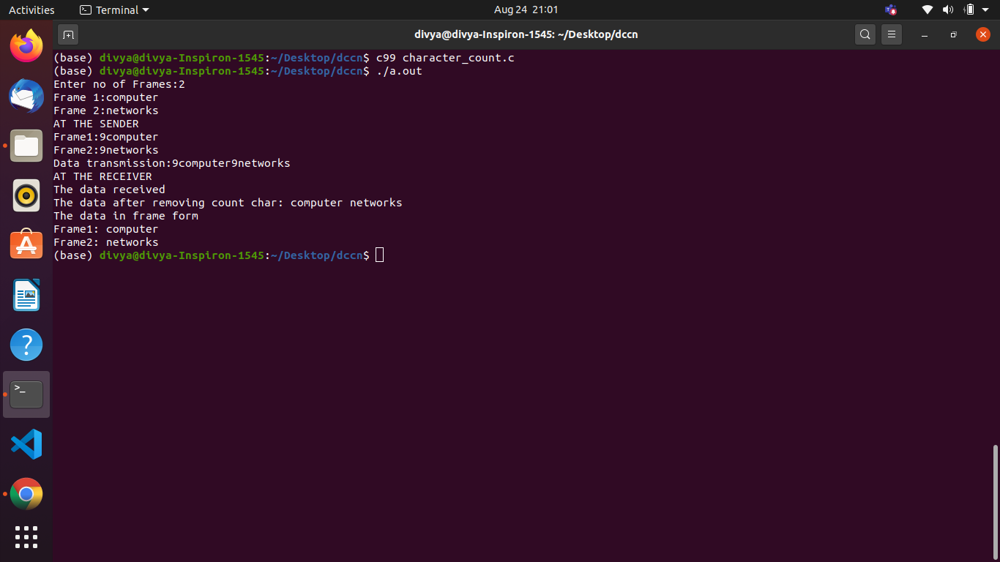
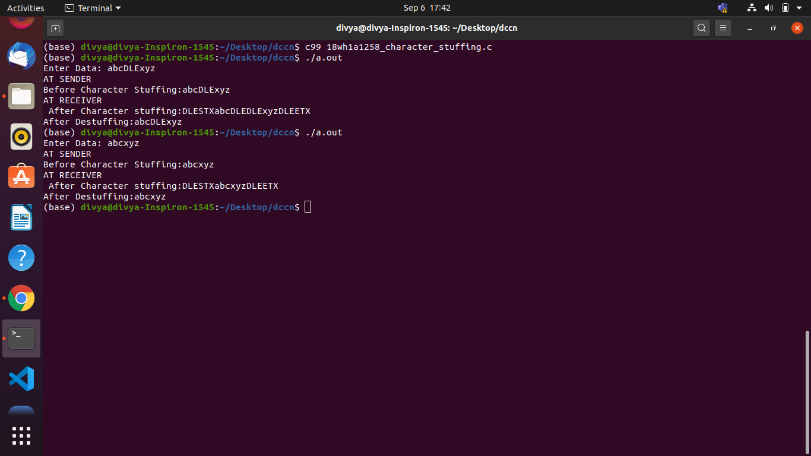
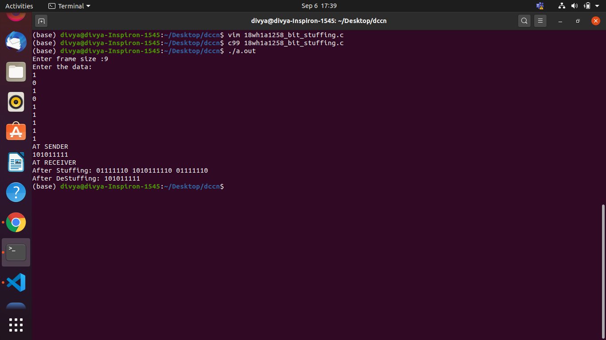

# Character Count

## Aim of the Experiment
To implement data link layer framing techniques such as
i. character count ii.character stuffing and iii. bit stuffing

### Steps or Procedure of experiment

#### Character count
1.This method uses a field in the header to specify the number of characters in the frame.
When the data link layer at the destination sees the character count,it knows how many characters follow, and hence where the end of the frame is. 

### Output

#### Character Stuffing
1.In the second method, each frame starts with the ASCII character sequence DLE STX and ends with the sequence DLE ETX.(where DLE is Data Link Escape, STX is Start of TeXt and ETX is End of TeXt.) This method overcomes the drawbacks of the character count method. If the destination ever loses synchronization, it only has to look for DLE STX and DLE ETX characters. If however, binary data is being transmitted then there exists a possibility of the characters DLE STX and DLE ETX occurring in the data. Since this can interfere with the framing, a technique called character stuffing is used. The sender's data link layer inserts an ASCII DLE character just before the DLE character in the data. The receiver's data link layer removes this DLE before this data is given to the network layer. However character stuffing is closely associated with 8-bit characters and this is a major hurdle in transmitting arbitrary sized characters.

### Output

#### Bit Stuffing
1.The third method allows data frames to contain an arbitrary number of bits and allows character codes with an arbitrary number of bits per character. At the start and end of each frame is a flag byte consisting of the special bit pattern 01111110 . Whenever the sender's data link layer encounters five consecutive 1s in the data, it automatically stuffs a zero bit into the outgoing bit stream. This technique is called bit stuffing. When the receiver sees five consecutive 1s in the incoming data stream, followed by a zero bit, it automatically destuffs the 0 bit. The boundary between two frames can be determined by locating the flag pattern.

### Output

